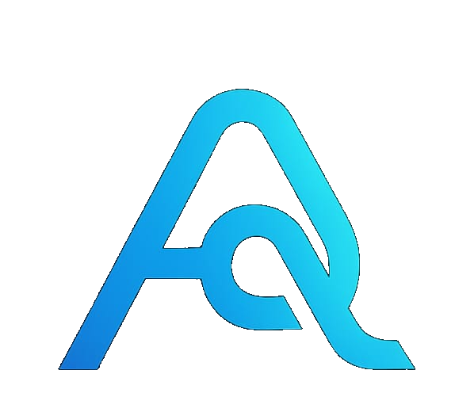

# AliQ Group Landing

Небольшой сайт компании **AliQ Group**. Теперь включает несколько страниц и форму обратной связи.

### Новые возможности
- Поддержка трёх языков (русский, казахский, английский)
- Отдельные страницы `services.html` и `schedule.html`
- Google Analytics и виджет онлайн-чата
- простое ограничение запросов на сервере

## Развёртывание

Сайт собирается как набор статических файлов и публикуется через GitLab Pages. Содержимое репозитория копируется в артефакт `public`, который GitLab использует для размещения.

Для локального просмотра достаточно открыть `index.html` в браузере. При внесении изменений их необходимо закоммитить и отправить в ветку `main`.

## Обработка формы

Для отправки заявок используется небольшой Node.js сервер (`server.js`). Он принимает POST-запросы по пути `/api/feedback`, ограничивает частоту обращений, затем пересылает данные на почту. Запустить сервер локально можно командой:

```bash
npm install
node server.js
```

## Политика конфиденциальности

Сайт собирает только данные, указанные в форме обратной связи (имя и вопрос). Они используются исключительно для связи с вами и не сохраняются после отправки. Информацию о посещениях собирает сервис Yandex.Metrica.



